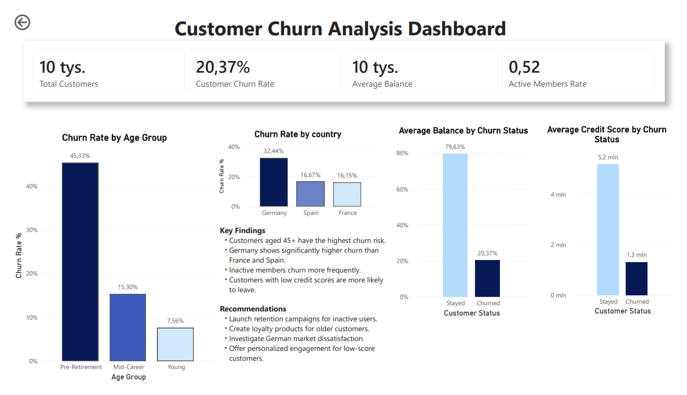
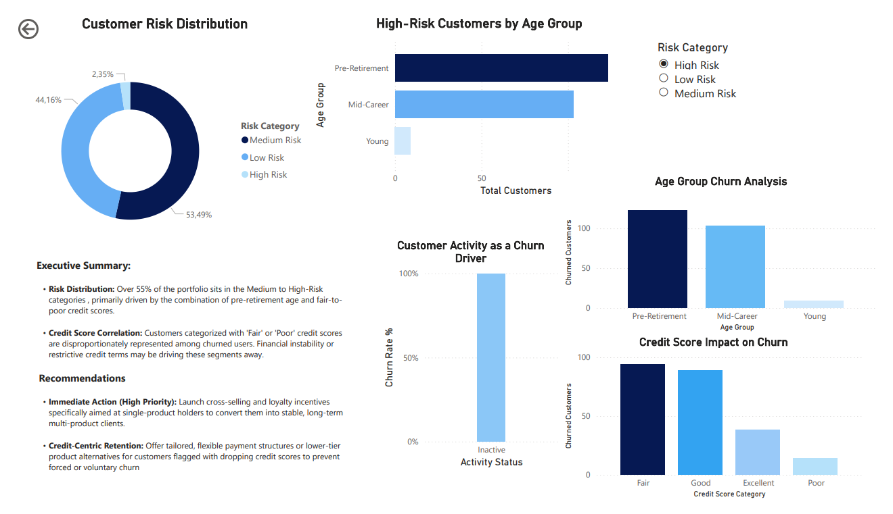
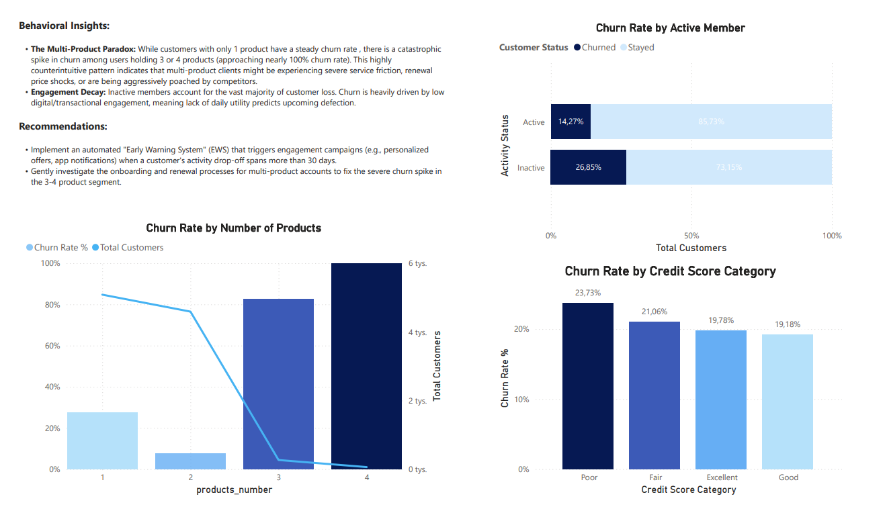

# Customer Churn Analysis & Risk Segmentation

## Project Overview
This project delivers an end-to-end data analysis focused on customer churn drivers, risk profiles, and business retention strategies. The analysis was prepared with a specific focus on financial and insurance sector insights (inspired by Gjensidige's market presence), combining deep data exploration via SQL with interactive reporting in Power BI.

## Tech Stack & Key Skills
**SQL:** Data manipulation, aggregations, conditional filtering (`CASE WHEN`), and metric calculations.
**Power BI / Business Intelligence:** Interactive dashboard engineering, KPI tracking, and UX-focused data visualization.
**Business Analytics:** Risk segmentation, churn prediction analysis, and actionable business recommendations.

## Main Insights & Business Recommendations

### 1. Geographical Risk (Germany Hotspot)

**Insight:** Germany shows an alarming **32.44%** churn rate – double the rate of France (16.15%) and Spain (16.67%). 
**Recommendation:** Launch an immediate market audit in Germany to identify localized friction points, customer dissatisfaction reasons, or aggressive competitor pricing.

### 2. Demographic Vulnerability (Pre-Retirement Segment)

**Insight:** Customers aged **45+ (Pre-Retirement)** have a massive **45.33%** churn rate, departing significantly faster than younger cohorts.
**Recommendation:** Develop tailored insurance and financial loyalty retention packages focusing on wealth preservation and senior-friendly service perks.

### 3. Behavioral Paradox (Multi-Product Friction)

**Insight:** Inactive members churn heavily. More importantly, there is a severe spike in churn among users holding **3 or 4 products** (approaching nearly 100%).
**Recommendation:** Urgently audit the customer journey and renewal pricing strategy for multi-product clients. Set up an automated **Early Warning System (EWS)** to trigger engagement campaigns when an account goes inactive for over 30 days.

---
Note: All relevant SQL queries and the source Power BI project file are available directly in this repository.
